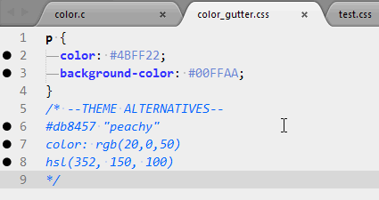

# Gutter Color

Gutter Color is a cross-platform Sublime Text plugin which displays a colored icon for all lines which contain a color.


## Requirements

* [ImageMagick](http://www.imagemagick.org/)

## Configure

* Install ImageMagick
* Set the `convert_path` in `Preferences: Package Settings > GutterColor > Settings – User` to the location of the ImageMagick `convert` script:

```json
{
  "convert_path" : "/usr/local/bin/convert"
}
```
* For help with either, view [this blog post by Wes Bos](http://wesbos.com/css-gutter-color-sublime-text/)
* *Additional user settings:*
    * `supported_syntax` sets the filetypes the script runs in.
    * `use_transparency` determines whether to draw RGBA, HSLA, and custom formats with alpha channels enabled, compositing the fill color over a checkered gray background. Setting this to `"light"` is the same as `true`, but uses a lighter checkerboard.
    * `custom_colors` adds additional regexes for custom color string formats, along with associated string matching and affixing rules. (See default settings file.)
    * `fix_color_schemes` enables automatic editing of the current tmTheme to correct ST's icon tinting. (See **Icon Tinting and Light Color Schemes** below.)

## Troubleshooting

#### Fixing ImageMagick on OSX
If you're experiencing issues with ImageMagick (installed via brew) when using GutterColor on OSX, follow these instructions to fix it.

1. Uninstall IM with `brew uninstall imagemagick`
2. Install again with a couple of options `brew install imagemagick --with-xz --with-font-config --with-little-cms --with-little-cms2`
3. Check the location of `convert` with `type convert`
4. Copy the location and edit the GutterColor/Settings - User `convert_path` to be the value of step 3.

#### Icon Tinting and Light Color Schemes
Sublime Text automatically tints gutter icons to match your background color settings. Unfortunately this can cause Gutter Color's samples to vary from slightly inaccurate to completely black. To counteract this effect, Gutter Color can generate a new copy of your current color scheme that sets the background to black *only for the scope of the plugin*. You will not see any visual changes other than the icons.



* To manually update a color scheme, open the Command Palette and select `GutterColor: Fix Current Color Scheme`.
* Alternatively, the plugin can run this process automatically via the setting `fix_color_schemes`.

#### Other Display Issues

Sublime's placeholder image is a red-and-yellow-striped box. If you are seeing these, it is most likely that Gutter Color cannot find ImageMagick to generate the samples. Double-check that you have your `convert_path` setting and/or your `PATH` environment variable set correctly, and restart Sublime Text. If the problem persists, feel free to [contact us](https://github.com/ggordan/GutterColor/issues).

## TODO

* Add support for SASS/LESS variables
* Backport to ST2
* Handle conflicts with GitGutter/VCS Gutter
* Support for CSS gradients
* Better cleanup processes

## Thanks
Thanks to all of the [contributors](https://github.com/ggordan/GutterColor/graphs/contributors) who continue to improve GutterColor!

# License

[MIT](/LICENSE).
